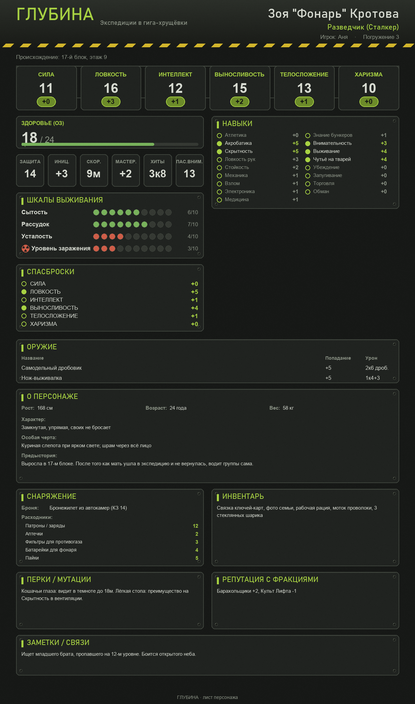

# ГЛУБИНА — конструктор листов персонажа

Десктоп-приложение для кампании «выживание в гига-хрущёвках». Игрок заполняет
форму → жмёт **Экспорт PNG** → получает готовую картинку-лист, которую можно
отправить мастеру.



## Запуск

Нужен **Python 3.12** (на 3.8 PySide6 в системе сломан).

```bat
py -3.12 -m pip install -r requirements.txt
py -3.12 app.py
```

Или просто двойной клик по **`Запуск.bat`**.

## Как пользоваться

- Слева — форма со всеми полями, справа — живой предпросмотр (обновляется на лету).
- **Сохранить…** — кладёт персонажа в `.json` (можно продолжить позже).
- **Открыть…** — загружает сохранённого персонажа.
- **Экспорт PNG…** — сохраняет картинку-лист для мастера.
- **🎲 Кости** — окно броска с анимацией: выбираешь кубик (Д6 / Д12 / Д20) и
  количество, жмёшь «Бросить» — грани мелькают и плавно замедляются, внизу
  показывается каждый кубик и сумма. Максимум на кубике подсвечивается красным.

## Система «ГЛУБИНА» (кратко)

- **6 характеристик:** Сила, Ловкость, Интеллект, Выносливость, Телосложение,
  Харизма. Модификатор как в 5e: `(значение − 10) // 2`.
- **Здоровье (ОЗ):** числовой блок тек/макс/времен.
- **Шкалы выживания:** Сытость, Рассудок, Усталость, Уровень заражения ☢.
- **Архетипы:** Разведчик, Технарь, Медик, Громила, Голос.
- Навыки, спасброски, оружие, расходники (патроны, аптечки, фильтры, батарейки,
  пайки), инвентарь, перки/мутации, репутация.
- **О персонаже:** рост, возраст, вес, характер, предыстория, особая черта
  (заболевание, псих. травма, необычная внешность, раса).

## Файлы проекта

| Файл | Что внутри |
|---|---|
| `system.py` | **Все правила сеттинга.** Хочешь поменять характеристики/навыки/шкалы — правь здесь, форма и картинка подстроятся сами. |
| `model.py` | Данные персонажа, расчёты бонусов, сохранение/загрузка. |
| `renderer.py` | Рисует картинку-лист (Pillow). Цвета и вёрстка — здесь. |
| `app.py` | Окно приложения (PySide6): форма + предпросмотр + кнопки. |
| `dice.py` | Окно броска костей с анимацией (Д6/Д12/Д20, несколько кубиков). |

## Как менять систему

Почти все правки делаются в **`system.py`** — это сделано специально, чтобы
не лазить по всему коду:

- добавить характеристику → добавь запись в `ABILITIES`;
- добавить навык → запись в `SKILLS` (укажи `ability`);
- новый архетип → строка в `ARCHETYPES`;
- новая шкала выживания → запись в `SURVIVAL_TRACKS`.
